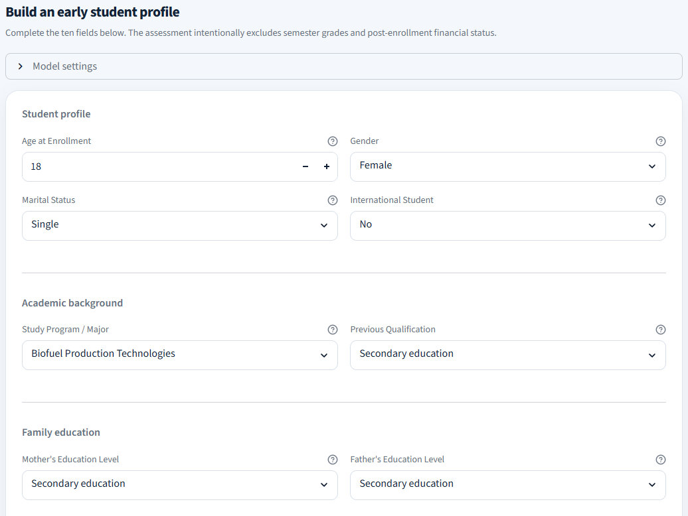
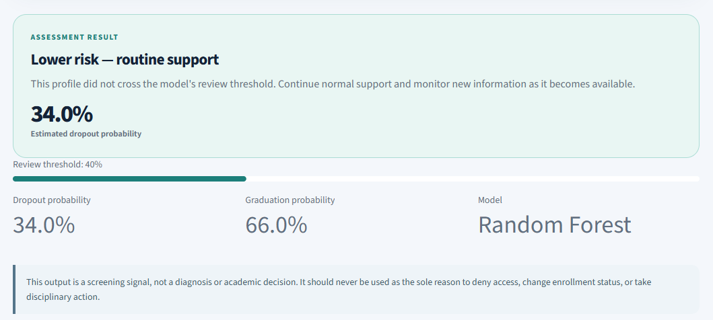
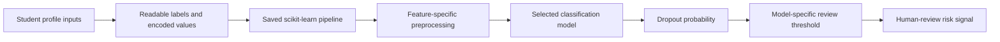
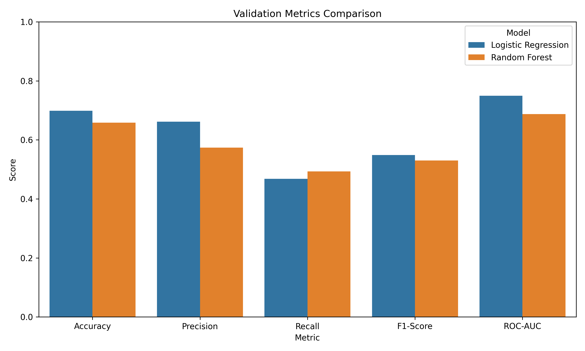
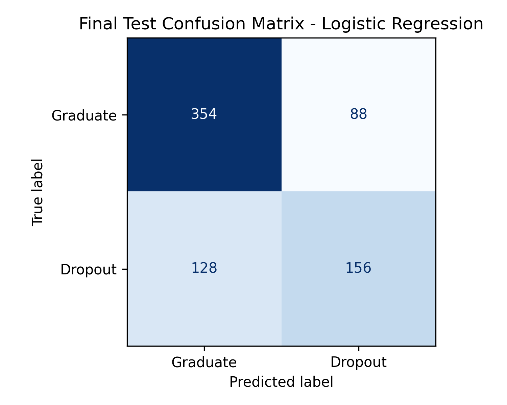

<div align="center">
  

  <h3>Early warning for student-support teams, powered by leakage-aware tabular machine learning.</h3>

  <p>
    EarlyDrop estimates student dropout risk from enrollment-time information, helping teams prioritize timely, human-led outreach before semester performance is available.
  </p>

  <p>
    <a href="https://student-dropout-prediction-ml-mvp.streamlit.app/">Live demo</a>
    &nbsp;|&nbsp;
    <a href="./docs/Final_Feature_Model_Plan.md">Methodology</a>
    &nbsp;|&nbsp;
    <a href="./notebooks/03_model_training_and_feature_selection.ipynb">Training notebook</a>
    &nbsp;|&nbsp;
    <a href="https://archive.ics.uci.edu/dataset/697/predict+students+dropout+and+academic+success">Dataset</a>
  </p>

  <p>
    
    
    
  </p>
</div>

> **Responsible-use note:** EarlyDrop is a portfolio demonstration and decision-support tool. It produces a screening signal, not an automated academic decision. Every flagged profile requires contextual human review.

## Overview

EarlyDrop is an end-to-end supervised machine learning application for early student dropout-risk assessment. It uses ten enrollment and background factors to estimate the probability that a student belongs to the dropout class, then compares that probability with a model-specific review threshold.

The project is deliberately scoped to an early-intervention setting. Semester grades, curricular-unit outcomes, tuition-payment status, debtor status, and scholarship status are excluded because they are either unavailable at enrollment or could introduce post-enrollment leakage. The result is a compact Streamlit product that demonstrates the full workflow from exploratory analysis and preprocessing to saved pipelines, model evaluation, and interactive inference.

This is a **tabular classification** project, not an NLP project. The data is structured student-record data, and the core task is binary classification between `Graduate` and `Dropout` outcomes.

## Application Preview

<p align="center">
  
</p>

The assessment form groups inputs into student profile, academic background, family education, and access-and-support sections. User-facing labels remain readable while the application preserves the encoded values expected by the saved pipeline.

<p align="center">
  
</p>

The result view communicates a review-oriented risk state, estimated dropout and graduation probabilities, the active model, and the configured review threshold.

## Product Experience

- **Early-stage assessment:** Collects ten practical inputs that can be available at or near enrollment.
- **Readable input design:** Translates encoded source categories into clear English labels without changing the model input contract.
- **Model selection:** Exposes the five trained candidate pipelines while presenting Random Forest as the recommended model.
- **Threshold-aware decisions:** Applies the threshold saved for the selected model instead of assuming the default 0.50 cutoff.
- **Review-oriented output:** Frames predictions as `Elevated risk, review recommended` or `Lower risk, routine support`, not deterministic student outcomes.
- **Transparent performance view:** Presents benchmark metrics, feature importance, threshold trade-offs, and test-set evaluation visuals.
- **Defensive artifact checks:** Stops the app if the feature configuration and saved-model metadata disagree.

## How It Works



The application loads the saved pipelines, model metadata, input configuration, and processed dataset at startup. A submitted profile becomes a one-row dataframe in the expected feature order. The selected pipeline transforms the raw values and returns class probabilities. EarlyDrop compares the dropout probability with the threshold stored for that model and renders a review-oriented result.

## Technical Methodology

### Problem definition and target construction

The original UCI dataset contains `Graduate`, `Dropout`, and `Enrolled` targets. The project removes `Enrolled` records and models the resulting binary task:

- `Graduate = 0`
- `Dropout = 1`

Dropout is treated as the positive class because the product goal is to surface potentially at-risk profiles early enough for supportive intervention.

### Feature scope

The deployed MVP has a fixed ten-feature contract:

1. Marital status
2. Study program
3. Previous qualification
4. Mother's education level
5. Father's education level
6. Displaced-student status
7. Educational special-needs status
8. Gender
9. Age at enrollment
10. International-student status

The same feature list is recorded in the saved model metadata, application configuration, processed dataset, and automated tests. This protects against a common deployment failure where the application sends a model an unexpected set or order of features.

### Feature-specific preprocessing

The model uses a `ColumnTransformer` inside each saved scikit-learn pipeline, so training and inference share the same transformations.

| Feature group | Transformation | Rationale |
| --- | --- | --- |
| `Displaced`, `Educational special needs`, `Gender`, `International` | Passthrough | These fields are already binary encoded. |
| `Age at enrollment` | `RobustScaler` | Handles the right-skewed distribution and is less sensitive to higher-age outliers. |
| `Marital status`, `Course`, `Previous qualification` | `OneHotEncoder(drop="first")` | Treats category codes as nominal values, not ordered quantities. |
| Mother's and father's qualification | Cross-fitted `TargetEncoder(cv=5)` | Keeps high-cardinality parental-education features compact while reducing target-leakage risk during training. |

### Model selection and threshold tuning

Five classical classification pipelines are evaluated with five-fold stratified cross-validation:

1. Logistic Regression
2. Random Forest
3. Gradient Boosting
4. Extra Trees
5. SVM with an RBF kernel

Random Forest is selected as the recommended model because it has the strongest dropout F1 score in the reported cross-validation comparison while maintaining competitive recall and ROC-AUC. The final Random Forest threshold is set to `0.40`, rather than the conventional `0.50`, to prioritize recall in an early-warning workflow.

Lowering the threshold increases the chance of flagging an at-risk student, but it also increases the number of profiles that need human review. The interface makes this trade-off explicit instead of presenting the output as a final decision.

## Model Performance

### Five-fold cross-validation

| Model | Recall | Precision | F1 score | ROC-AUC |
| --- | ---: | ---: | ---: | ---: |
| Random Forest | 0.684 | 0.614 | **0.647** | **0.770** |
| Extra Trees | **0.690** | 0.599 | 0.641 | 0.764 |
| SVM (RBF) | 0.683 | 0.598 | 0.638 | 0.762 |
| Logistic Regression | 0.666 | 0.610 | 0.637 | 0.759 |
| Gradient Boosting | 0.562 | **0.665** | 0.609 | 0.766 |

<p align="center">
  
</p>

### Final Random Forest evaluation

| Metric | Result |
| --- | ---: |
| Decision threshold | 0.40 |
| Accuracy | 0.654 |
| Precision | 0.537 |
| Dropout recall | **0.838** |
| F1 score | **0.655** |
| ROC-AUC | **0.775** |

The final threshold identifies approximately 83.8% of dropout cases in the held-out evaluation. That recall-focused operating point produces lower precision, so it is suitable only when alerts are reviewed by people who can assess the student's wider context.

<p align="center">
  
</p>

## Technology

| Area | Tools |
| --- | --- |
| Interface | Streamlit 1.55 |
| Application logic | Python 3.11, joblib |
| Data handling | pandas 2.3, NumPy 2.3 |
| Modeling | scikit-learn 1.8 |
| Reporting | Matplotlib, Seaborn |
| Testing | Python `unittest`, scikit-learn pipeline inference checks |

## Repository Structure

```text
student-dropout-prediction-ml/
|-- .streamlit/
|   `-- config.toml                         # Streamlit theme and runtime settings
|-- app/
|   |-- app.py                              # Streamlit interface and inference flow
|   `-- feature_config.json                 # Readable labels, mappings, and input settings
|-- assets/
|   |-- earlydrop-logo.svg                  # Brand asset
|   `-- screenshots/                        # Verified application screenshots
|-- data/
|   |-- raw/dataset.csv                     # Source dataset copy
|   `-- processed/                          # Prepared model inputs and readable variants
|-- docs/                                   # Scope, methodology, and project rationale
|-- models/                                 # Serialized pipelines and model metadata
|-- notebooks/
|   |-- 01_eda.ipynb
|   |-- 02_preprocessing.ipynb
|   `-- 03_model_training_and_feature_selection.ipynb
|-- reports/
|   |-- figures/                            # Evaluation charts and confusion matrices
|   `-- *.csv                               # Model and threshold results
|-- tests/test_model_artifacts.py           # Artifact-contract and inference checks
|-- requirements.txt
|-- requirements-dev.txt
`-- README.md
```

## Run Locally

Python 3.11 is recommended because the serialized artifacts were created with the pinned NumPy and scikit-learn versions in `requirements.txt`.

```bash
git clone https://github.com/LecyLecy/student-dropout-prediction-ml.git
cd student-dropout-prediction-ml
python -m venv .venv
```

Activate the environment:

```bash
# Windows PowerShell
.venv\Scripts\Activate.ps1

# macOS or Linux
source .venv/bin/activate
```

Install dependencies and run the application:

```bash
python -m pip install -r requirements.txt
python -m streamlit run app/app.py
```

Open `http://localhost:8501` when Streamlit finishes starting.

## Reproduce the Analysis

Install the notebook-development dependencies:

```bash
python -m pip install -r requirements-dev.txt
```

Run the notebooks in this order:

1. `notebooks/01_eda.ipynb`
2. `notebooks/02_preprocessing.ipynb`
3. `notebooks/03_model_training_and_feature_selection.ipynb`

The training notebook writes the serialized pipelines, metadata, result tables, and report figures used by the Streamlit application.

## Testing and Validation

The repository includes artifact-level automated tests in `tests/test_model_artifacts.py`. They verify that:

- the feature contract matches across application configuration, model metadata, and processed data;
- every declared model is available in the saved pipeline collection;
- every pipeline produces a finite, valid two-class probability distribution for a real data row.

Run the test suite with:

```bash
python -m unittest discover -s tests -v
```

## Limitations

- The data represents one higher-education context, so reported performance should not be assumed to transfer to another institution or country.
- The application supports early screening, not causal explanation or individual outcome certainty.
- The recall-first threshold trades precision for sensitivity, which can create additional review workload.
- Demographic and family-background features require local fairness, privacy, and governance review before operational use.
- The project ships pretrained artifacts rather than a scheduled retraining or production monitoring workflow.

## Future Improvements

- Validate the pipeline on recent, institution-specific data and recalibrate probabilities.
- Audit error rates and calibration across relevant student groups before any operational deployment.
- Add controlled access, audit logging, and a documented reviewer workflow.
- Replace manually supplied context variables with institution-approved data integrations where appropriate.
- Add drift monitoring and a reproducible retraining process for updated datasets.

## Data, Attribution, and License

This project uses the [Predict Students' Dropout and Academic Success](https://archive.ics.uci.edu/dataset/697/predict+students+dropout+and+academic+success) dataset from the UCI Machine Learning Repository.

> Realinho, V., Machado, J., Baptista, J., and Martins, M. V. (2022). *Predict Students' Dropout and Academic Success* [Data set]. UCI Machine Learning Repository. https://doi.org/10.24432/C5MC89

No license file is currently included in this repository. Confirm the dataset terms and add a project license before redistributing or extending the work.

## Documentation

- [Feature and model selection plan](./docs/Final_Feature_Model_Plan.md)
- [Project rationale and conclusion](./docs/Project_Rationale_and_Conclusion.md)
- [Project proposal](./docs/Proposal_ML_Group_10.md)
