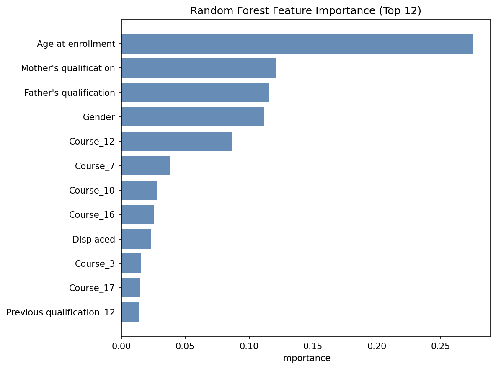

# EarlyDrop — Student Dropout Risk Assessment

[](https://student-dropout-prediction-ml-mvp.streamlit.app/)
[](https://www.python.org/)
[](https://scikit-learn.org/)

An end-to-end machine learning project for identifying student dropout risk from information available at or near enrollment. The project covers exploratory analysis, leakage-aware preprocessing, model comparison, recall-first threshold tuning, evaluation, and a polished Streamlit interface.

> This is a screening demonstration, not an automated academic decision system. Every flagged profile requires contextual human review.

## Why this project matters

Semester performance can reveal disengagement, but waiting for grades may delay support. EarlyDrop explores whether a small set of enrollment and background factors can produce a useful early signal before semester-level academic data exists.

The app is designed for a student-support workflow:

- collect ten understandable early-stage inputs;
- estimate dropout risk with a saved end-to-end pipeline;
- compare the estimate with a recall-first review threshold;
- present the result as a review signal rather than a definitive outcome.

## Final model

Five classical classifiers were compared with five-fold stratified cross-validation:

| Model | Recall | Precision | F1 score | ROC–AUC |
|---|---:|---:|---:|---:|
| Random Forest | 0.684 | 0.614 | **0.647** | **0.770** |
| Extra Trees | **0.690** | 0.599 | 0.641 | 0.764 |
| SVM (RBF) | 0.683 | 0.598 | 0.638 | 0.762 |
| Logistic Regression | 0.666 | 0.610 | 0.637 | 0.759 |
| Gradient Boosting | 0.562 | **0.665** | 0.609 | 0.766 |

Random Forest was selected for its overall recall–precision balance. Its final decision threshold was lowered from `0.50` to `0.40` to prioritize early detection.

| Final test metric | Result |
|---|---:|
| Dropout recall | **0.838** |
| Precision | 0.537 |
| F1 score | **0.655** |
| ROC–AUC | **0.775** |
| Accuracy | 0.654 |


## Input scope

The deployed model uses ten features that are available early and practical to collect:

1. Marital status
2. Study program
3. Previous qualification
4. Mother's education level
5. Father's education level
6. Displaced-student status
7. Educational special-needs status
8. Gender
9. Age at enrollment
10. International-student status

Semester grades, tuition-payment status, debtor status, and scholarship status are intentionally excluded to keep the prediction stage early and reduce leakage.

## Preprocessing pipeline

Different feature types receive purpose-specific transformations:

- binary flags use passthrough;
- age at enrollment uses `RobustScaler`;
- nominal categories use `OneHotEncoder`;
- high-cardinality parental-education fields use cross-fitted `TargetEncoder`;
- preprocessing and estimation are stored together as scikit-learn pipelines.



Feature importance describes how the model makes predictions; it does not establish causation.

## Repository structure

```text
student-dropout-prediction-ml/
|-- .streamlit/             # App theme and runtime configuration
|-- app/
|   |-- app.py              # Streamlit application
|   `-- feature_config.json # English labels and input metadata
|-- data/
|   |-- raw/                # Source dataset
|   `-- processed/          # Modeling and readable datasets
|-- docs/                   # Scope, rationale, and project documentation
|-- models/                 # Saved model pipelines and metadata
|-- notebooks/
|   |-- 01_eda.ipynb
|   |-- 02_preprocessing.ipynb
|   `-- 03_model_training_and_feature_selection.ipynb
|-- reports/
|   |-- figures/            # Evaluation visualizations
|   `-- *.csv               # Model and threshold results
|-- requirements.txt
`-- README.md
```

## Run locally

Python 3.11 is recommended because the saved artifacts were created with the pinned NumPy and scikit-learn versions.

```bash
git clone https://github.com/LecyLecy/student-dropout-prediction-ml.git
cd student-dropout-prediction-ml

python -m venv .venv
```

Activate the environment:

```bash
# Windows
.venv\Scripts\activate

# macOS or Linux
source .venv/bin/activate
```

Install and run:

```bash
python -m pip install -r requirements.txt
python -m streamlit run app/app.py
```

The app will be available at `http://localhost:8501`.

## Reproduce the analysis

Install the notebook dependencies:

```bash
python -m pip install -r requirements-dev.txt
```

Run the notebooks in order:

1. `notebooks/01_eda.ipynb`
2. `notebooks/02_preprocessing.ipynb`
3. `notebooks/03_model_training_and_feature_selection.ipynb`

The model-training notebook exports the pipelines, metadata, evaluation tables, and figures used by the app.

## Dataset

The project uses [Predict Students' Dropout and Academic Success](https://archive.ics.uci.edu/dataset/697/predict+students+dropout+and+academic+success) from the UCI Machine Learning Repository.

The original target contains `Graduate`, `Dropout`, and `Enrolled`. `Enrolled` records are removed to define the final binary classification task:

- `Graduate = 0`
- `Dropout = 1`

## Responsible use

The source data reflects a specific higher-education context. Before any operational use, an institution should:

- validate performance on local and recent data;
- audit error rates across relevant student groups;
- define a documented human-review process;
- monitor drift and unintended impacts;
- use predictions to offer support, never to restrict opportunity.

## Documentation

- [Feature and model selection plan](docs/Final_Feature_Model_Plan.md)
- [Project rationale and conclusion](docs/Project_Rationale_and_Conclusion.md)
- [Project proposal](docs/Proposal_ML_Group_10.md)

## Tech stack

Python · pandas · scikit-learn · joblib · Streamlit · Matplotlib · Seaborn
